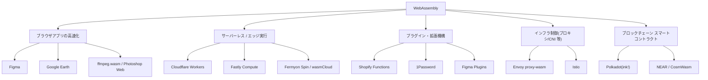

# WebAssembly (Wasm) と WIT (Component Model) の基礎

## 概要

**WebAssembly (Wasm)** は、C/C++/Rust/Go など様々な言語からコンパイル可能な、ポータブルでサンドボックス化されたバイナリ命令フォーマット(仮想マシン)です。もともとブラウザで JavaScript に代わる高速な実行手段として設計されましたが、現在はサーバーサイド・エッジ・プラグイン基盤など幅広い環境で使われています。

**WIT (WebAssembly Interface Type)** は、Wasm の拡張仕様である **Component Model** の中核をなす IDL(インターフェース定義言語)です。Wasm モジュール同士が、言語を問わず文字列や構造体などの「意味のある型」をやり取りできるようにするための仕組みです。

Wasm の実際の採用領域は多岐にわたり、大きく分けると次の5つに整理できます。



## 何が嬉しいのか

**Wasm 単体のメリット**

- near-native な実行速度
- ロード時検証によるメモリ安全性
- サンドボックスによる隔離実行
- 言語非依存(1つのランタイムで多言語のコードを動かせる)

コンテナよりも軽量な隔離実行環境として、プラグインシステムやマルチテナント環境での利用が進んでいます。

**なぜ WIT が必要か**

素の(core)Wasm がやり取りできるのは `i32`/`i64`/`f32`/`f64` という数値だけで、文字列やリスト、構造体を渡すには、呼び出し側と呼ばれる側で手動でメモリレイアウトを合わせてシリアライズ/デシリアライズする必要がありました。これは特に「Rust で書かれたモジュールから Python で書かれたモジュールを呼ぶ」といった多言語構成では非常に煩雑でした。

WIT はこの型変換を標準化することで、**異なる言語で書かれた Wasm コンポーネントを、まるで同じプロセス内の関数呼び出しのように組み合わせられる**ようにします。

具体的なユースケース:
- プラグイン機構(例: ホストアプリが WIT で定義したインターフェースを実装するプラグインを、言語を問わず受け入れる)
- マイクロサービス的にコンポーネントを組み合わせるアーキテクチャ(サービスの一部を差し替え可能にする)

Wasm を使わない場合と比べると、例えばプラグインシステムをネイティブ拡張(共有ライブラリのロードなど)で実装する場合はプロセスクラッシュのリスクや言語ロックインが生じますが、Wasm ならサンドボックス化された状態で任意の言語のプラグインを安全に受け入れられます。

## 詳細

### Wasm の基本構造

- スタックベースの仮想マシンで、線形メモリ(バイト配列)・関数テーブル・グローバル変数などを持つモジュールとして表現されます。
- ロード時にバイトコードが検証(validation)されるため、型安全性が保証されます。
- **WASI (WebAssembly System Interface)** は、ファイルシステムやネットワークなど OS リソースへの標準化されたアクセス方法を提供する仕様で、ブラウザ外での実行を支えています。

### Component Model と WIT

Component Model は、core Wasm モジュールを「コンポーネント」としてラップし、WIT で定義したインターフェースを import/export できるようにする仕様です。WIT は `record`(構造体)、`variant`(タグ付き共用体)、`enum`、`list`、`string`、`option`、`result`、`resource`(ハンドル)といった高レベルな型をサポートします。

WIT の例:

```wit
package example:calculator;

interface calc {
  add: func(a: s32, b: s32) -> s32;
}

world calculator {
  export calc;
}
```

`wit-bindgen` のようなツールを使うと、WIT 定義から Rust・C・Python・JavaScript・Go などのバインディングコードを自動生成できます。これにより、開発者は低レベルなメモリ変換を意識せず、各言語のネイティブな型として値をやり取りできます。実行環境としては `wasmtime`、`WasmEdge`、`Wasmer` などが Component Model のサポートを進めています。Rust では `cargo component`、JavaScript 向けには `jco` といったツールチェーンがあります。

### 実際の活用例

**1. ブラウザアプリケーションの高速化**
- **Figma**: デザインツールのレンダリングエンジンを C++ から Wasm にコンパイルして利用。起動速度が大幅に向上したことで知られています。
- **Google Earth**: 従来 NaCl(Native Client)で動いていた地図描画ロジックを Wasm に移行し、Chrome 以外のブラウザでも動作するようになりました。
- **ffmpeg.wasm / Photoshop on the web**: 動画エンコードや画像編集など、本来ネイティブアプリでしか実現できなかった重い処理をブラウザ内で完結させる例です。
- **AutoCAD Web**: 数十年分の C++ 資産を JavaScript に書き直すことなく、Wasm 経由でブラウザに移植した事例として有名です。

**2. サーバーレス / エッジコンピューティング**
- **Cloudflare Workers**: V8 Isolate 上で JavaScript に加えて Wasm も実行可能。起動が数ミリ秒と高速なため、リクエストごとに新しいサンドボックスを立ち上げるモデルに向いています。
- **Fastly Compute**(旧 Compute@Edge): エッジで任意のロジックを Wasm として実行するプラットフォーム。Rust/Go/JS などから Wasm にコンパイルして CDN のエッジノードで動かせます。
- **Fermyon Spin / wasmCloud**: Kubernetes に代わる軽量な Wasm 専用の実行基盤として、マイクロサービスやイベント駆動アプリケーションのランタイムに使われています。

**3. プラグイン・拡張機構**
- **Shopify Functions**: ECサイトの送料計算や割引ロジックなど、マーチャント(利用者)が任意の言語で書いたカスタムロジックを、Shopify のサーバー上で安全にサンドボックス実行するために Wasm を使用しています。
- **1Password**: パスワードマネージャーの一部のコアロジックを Wasm 化し、複数プラットフォーム間でコードを共有しています。
- Figma などの SaaS プロダクトのプラグインシステムでも、サードパーティコードを安全に隔離実行する目的で使われています。

**4. インフラ・ネットワーク制御(プロキシ拡張)**
- **Envoy (proxy-wasm)**: サービスメッシュで使われる Envoy プロキシに、認証・レート制限・ロギングなどのカスタムフィルタを Wasm モジュールとして動的にロードできます。Istio などもこの仕組みを活用しています。ネイティブ拡張(C++ プラグイン)と違い、プロキシ本体の再ビルド・再デプロイなしにロジックを追加・更新できるのが利点です。

**5. ブロックチェーン / スマートコントラクト**
- **Polkadot(ink!)**、**NEAR**、**CosmWasm(Cosmos エコシステム)** などでは、スマートコントラクトの実行環境として Wasm を採用しています。決定的な実行結果・サンドボックス化・多言語対応(Rust など)という特性が、ブロックチェーン実行環境の要件と相性が良いためです。

**6. Kubernetes / コンテナ代替としての利用(Component Model 関連)**
- **runwasi / containerd-shim-wasm**、**Krustlet** などにより、Wasm モジュールを Kubernetes 上で通常の Pod と同じように(コンテナのより軽量な代替として)スケジュール・実行する取り組みが進んでいます。コンテナに比べて起動が数桁速く、イメージサイズも小さいため、コールドスタートが問題になるようなワークロードで注目されています。

WIT / Component Model は、上記のうち特に「②サーバーレス/エッジ」「③プラグイン機構」「⑥Kubernetes 代替」の領域で、多言語コンポーネントを組み合わせる際の標準インターフェースとして重要性が増しています。

### 注意点

- Component Model / WIT はまだ活発に仕様策定・実装が進んでいる領域です。ツールやランタイムのバージョンによって対応状況が異なるため、実際に採用する際は各ランタイムの対応状況を公式ドキュメントで確認することをおすすめします。
- 上記の活用例は執筆時点(2026年前半頃)の情報に基づくものです。特にサーバーサイド・エッジ領域や Component Model 関連の取り組みは変化が速いため、最新の採用状況は各プロジェクトの公式情報を確認する必要があります。この点は不確実性が高いことに留意してください。

## 参考リンク

- [WebAssembly 公式サイト](https://webassembly.org/)
- [Component Model 公式ドキュメント](https://component-model.bytecodealliance.org/)
- [WebAssembly/component-model (GitHub)](https://github.com/WebAssembly/component-model)
- [WASI 公式サイト](https://wasi.dev/)
- [wit-bindgen (GitHub)](https://github.com/bytecodealliance/wit-bindgen)
- [Cloudflare Workers - WebAssembly](https://developers.cloudflare.com/workers/runtime-apis/webassembly/)
- [Fastly Compute Documentation](https://www.fastly.com/documentation/guides/compute/)
- [Shopify Functions](https://shopify.dev/docs/apps/build/functions)
- [Envoy proxy-wasm](https://github.com/proxy-wasm/spec)
- [WasmEdge / runwasi (containerd shim for Wasm)](https://github.com/containerd/runwasi)
- [CosmWasm](https://cosmwasm.com/)
