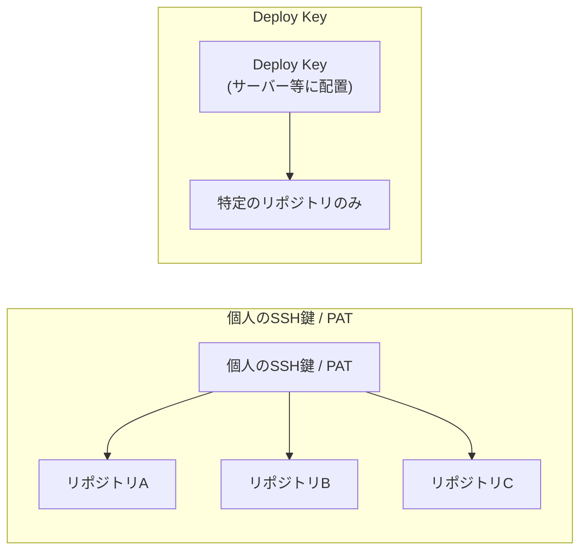
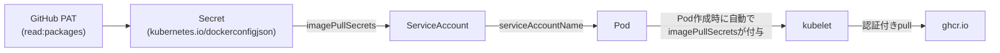

# GitHub Deploy Keys の仕組みと使いどころ

## 概要

Deploy Key(デプロイキー)は、**特定の1つのリポジトリ(プロジェクト)だけにアクセス権を与える SSH 公開鍵**です。GitHub・GitLab いずれも、リポジトリの設定画面から公開鍵を登録することで、サーバーや CI/CD など「人間ではない主体」にそのリポジトリへの `git clone` / `git pull`(必要なら `git push`)権限だけをピンポイントで渡せます。個人の SSH 鍵や Personal Access Token(PAT)がユーザーアカウントに紐づき、そのユーザーがアクセスできる全リポジトリに対して有効になるのに対し、Deploy Key は登録した1リポジトリのみにスコープが限定される点が最大の特徴です。



GitLab には GitHub の Deploy Key に相当する機能に加えて、HTTPS 経由でアクセスする「Deploy Token」という別機能もあり、目的や運用形態によって使い分けます。またコンテナ運用の実務では、GitHub Container Registry(GHCR)のようなプライベートレジストリへの認証を Kubernetes の ServiceAccount 経由で自動化する場面でも、この認証情報設計の考え方がそのまま関わってきます。

## 何が嬉しいのか

Deploy Key を使わない場合、サーバーや CI から特定のリポジトリにアクセスするには次のような選択肢しかなく、いずれも権限が過剰になりがちです。

- **開発者個人の SSH 鍵をサーバーに置く**: その人がアクセスできる全リポジトリに対して権限を持ってしまい、サーバーが乗っ取られた際の被害範囲が大きい。鍵の持ち主が退職・異動すると管理も煩雑になる
- **専用の「マシンユーザー(bot アカウント)」を作る**: 有効だが、Organization の Seat 数を消費したり、招待・権限管理の手間が増える

Deploy Key はリポジトリ単位でスコープが閉じているため、**最小権限の原則**を満たしやすく、次のようなユースケースに向いています。

- 本番サーバーが特定のリポジトリの最新コードを `git pull` して自動デプロイする
- CI/CD パイプラインが、プライベートな Git submodule を含む特定リポジトリを clone する
- 監視ツールやビルドサーバーなど、単一リポジトリだけにアクセスできればよい自動化ジョブ

さらに GHCR のようなコンテナレジストリからプライベートイメージを pull する場面では、個人の PAT をそのまま使うと「その人の退職・トークン失効でクラスタ全体の pull が止まる」リスクがあります。Deploy Key や GitHub App と同様に、認証情報を特定個人から切り離して管理する発想が、Kubernetes の `imagePullSecrets` 設計でも重要になります。

## 詳細

### GitHub の Deploy Key

**登録方法**

1. サーバー側で `ssh-keygen -t ed25519 -C "deploy-key-for-xxx"` のようにキーペアを生成する
2. リポジトリの `Settings > Deploy keys > Add deploy key` で公開鍵(`.pub` ファイルの中身)を登録する
3. サーバー側では秘密鍵を `~/.ssh/` などに配置し、`git clone git@github.com:owner/repo.git` を実行する

**権限レベル**

- デフォルトは**読み取り専用**(clone / pull のみ)
- 登録時に **"Allow write access"** にチェックを入れると push も可能になる。CI からタグを push したい、`gh-pages` ブランチを更新したいといった用途でのみ有効にすべき

**制約・注意点**

- 1つの公開鍵は**1つのリポジトリにしか登録できない**。同じ公開鍵を別リポジトリに登録しようとすると `key is already in use` エラーになる。複数リポジトリに同じサーバーからアクセスしたい場合は、リポジトリごとに鍵を分けるか、GitHub App や machine user のような別の仕組みを検討する
- ユーザーアカウントに紐づかないため、GitHub の Audit log で「誰が」操作したかの追跡がしづらい。組織的に複数人・複数サービスが絡む場合は、インストールごとにトークンが発行され権限も細かく設定できる GitHub App の利用が推奨されることが多い
- GitHub Actions のワークフロー内から同一リポジトリを操作するだけなら、Deploy Key を用意しなくても組み込みの `GITHUB_TOKEN` で足りるケースがほとんど。Deploy Key は「Actions の外にある別サーバー」や「Actions から別リポジトリにアクセスしたい」場合に検討する選択肢

### GitHub と GitLab の比較

用途・思想は同じ(「人間ではない主体にリポジトリ単位で最小権限を渡す」)ですが、以下の違いがあります。

1. **鍵の使い回し**: GitHub は「1公開鍵につき1リポジトリ」という制約がある一方、GitLab は登録者がそのプロジェクトへの Maintainer 以上の権限を持てば、同じ Deploy Key を他のプロジェクトでも有効化できる
2. **Group Deploy Key**: GitLab にはグループ配下の複数プロジェクトへまとめて有効化できる Group Deploy Key がある(上位プラン限定の場合があり、正確なプラン要件は未確認。公式ドキュメントで要確認)。GitHub の Deploy Key に相当する機能はなく、複数リポジトリを横断したい場合は GitHub App が必要
3. **Deploy Token という別機能の有無**: GitLab には SSH 鍵ではなく HTTPS 経由でアクセスする「Deploy Token」という別機能が存在する(詳細は次項)

| 方式 | スコープ | 主な用途 |
|---|---|---|
| Deploy Key | リポジトリ1つ | サーバー・単一目的の自動化からのアクセス |
| 個人 SSH 鍵 | ユーザーがアクセスできる全リポジトリ | 開発者本人の作業 |
| PAT (fine-grained) | 選択したリポジトリ群 | 複数リポジトリを跨ぐスクリプト・ツール |
| GitHub App | インストール先・権限を細かく設定可能 | 組織的な自動化・サードパーティ連携 |

### GitLab Deploy Token と GitHub での代替

GitLab の Deploy Token は「①ユーザーアカウントに紐づかない」「②プロジェクト(またはグループ)単位でスコープを絞れる」「③HTTPS の clone/pull だけでなく Container Registry / Package Registry にもアクセスできる」「④有効期限を設定できる」という性質を1つの機能で持っています。GitHub にはこれに1対1で対応する単一機能はなく、目的に応じて以下を組み合わせる必要があります。

**1. HTTPS 経由の clone/pull(push)が目的 → Fine-grained PAT**

- `Settings > Developer settings > Personal access tokens > Fine-grained tokens > Generate new token`
- `Repository access` で `Only select repositories` を選び対象リポジトリを指定
- `Permissions > Repository permissions > Contents` を `Read-only` または `Read and write` に設定
- `Expiration` で有効期限を設定(最長1年、Organization 設定により無期限も可)
- 利用例: `git clone https://x-access-token:<TOKEN>@github.com/owner/repo.git`
- 注意: fine-grained PAT は発行者個人のアカウントに紐づく点が、GitLab Deploy Token の「ユーザーから完全に独立」とは異なる

**2. Container Registry(GHCR)/ Packages へのアクセスが目的**

- GitHub Actions のワークフロー内であれば追加トークン不要で、`GITHUB_TOKEN` に権限を設定するだけでよい
  ```yaml
  permissions:
    packages: write   # push する場合。読み取りのみなら read
  ```
- Actions の外(別サーバーや他社 CI)からは `read:packages` / `write:packages` スコープを持つ PAT が必要。Packages 系スコープは fine-grained PAT より classic PAT でのサポートが中心(不確実な情報。最新の対応状況は公式ドキュメントで要確認)

**3. 「ユーザー非依存・スコープ限定・短命トークン」という設計思想に最も近い → GitHub App**

1. `Settings > Developer settings > GitHub Apps > New GitHub App` でアプリを作成
2. `Repository permissions` で必要最小限の権限のみ付与(例: `Contents: Read and write`, `Packages: Read and write`)
3. 対象リポジトリ(または特定のリポジトリ群)にのみ **Install** する(Deploy Token のプロジェクトスコープに相当)
4. アプリの秘密鍵(Private key)を生成し、デプロイ先サーバーや CI に安全に配置
5. デプロイのたびに、秘密鍵で署名した JWT から**有効期限1時間の installation access token** を発行して使う
   - GitHub Actions 内であれば [`actions/create-github-app-token`](https://github.com/actions/create-github-app-token) で発行できる
   - 発行したトークンは `git clone https://x-access-token:<INSTALLATION_TOKEN>@github.com/owner/repo.git` の形で利用可能

トークンが短命(1時間)で自動失効し、特定ユーザーの Seat も消費しない点は GitLab Deploy Token より安全性が高いとも言えますが、アプリ作成・秘密鍵管理・トークン発行ロジックの実装が必要な分セットアップの手間は大きくなります。

| GitLab Deploy Token の機能 | GitHub での代替 | 必要な設定 |
|---|---|---|
| HTTPS で clone/pull(push) | Fine-grained PAT | 対象リポジトリを選択し Contents 権限・有効期限を設定 |
| Container/Package Registry アクセス | `GITHUB_TOKEN`(Actions内)/ classic PAT(Actions外) | ワークフローの `permissions` 設定、または `read:packages`/`write:packages` スコープ |
| ユーザーに紐づかない・プロジェクトスコープ・短命トークン | GitHub App + installation token | App 作成、対象リポジトリへの Install、秘密鍵管理、都度トークン発行 |
| SSH での clone/pull(push) | Deploy Key | リポジトリの Deploy keys に公開鍵登録 |

### Kubernetes ServiceAccount + imagePullSecrets での GHCR 認証(実践例)

K8s の ServiceAccount に `imagePullSecrets` を設定すると、その ServiceAccount を使う Pod に Docker レジストリの認証情報が自動的に付与され、`kubelet` がプライベートな GHCR (`ghcr.io`) イメージを認証付きで pull できるようになります。手順は「①認証情報を Secret として登録」「②その Secret を ServiceAccount に紐付ける」の2ステップです。



**1. GHCR 用の認証情報を持つ Secret を作る**

`ghcr.io` からの pull には、`read:packages` スコープを持つ **classic PAT** を使うのが最も確実です(fine-grained PAT の Packages 対応は前述の通り現状限定的なため)。

```bash
kubectl create secret docker-registry ghcr-pull-secret \
  --docker-server=ghcr.io \
  --docker-username=<GitHubユーザー名 or Organization名> \
  --docker-password=<PAT (read:packages scope)> \
  --docker-email=<任意のメールアドレス> \
  -n <namespace>
```

これで `kubernetes.io/dockerconfigjson` タイプの Secret が作られます。

**2. ServiceAccount に imagePullSecrets を紐付ける**

```bash
kubectl patch serviceaccount default \
  -n <namespace> \
  -p '{"imagePullSecrets": [{"name": "ghcr-pull-secret"}]}'
```

または YAML で管理する場合:

```yaml
apiVersion: v1
kind: ServiceAccount
metadata:
  name: my-app-sa
  namespace: my-namespace
imagePullSecrets:
  - name: ghcr-pull-secret
```

Pod 側は `serviceAccountName: my-app-sa` を指定するだけで、Pod 自身の spec に `imagePullSecrets` を書く必要はありません。

```yaml
spec:
  serviceAccountName: my-app-sa
  containers:
    - name: app
      image: ghcr.io/<owner>/<repo>:<tag>
```

**仕組み・注意点**

- **自動付与のタイミング**: ServiceAccount の `imagePullSecrets` は、その ServiceAccount を使う Pod が**新規作成される瞬間**に Pod の `.spec.imagePullSecrets` へ自動的にマージされる。すでに動いている Pod には遡って反映されないため、既存 Pod に効かせたい場合はロールアウト(再作成)が必要
- **namespace ごとの default ServiceAccount**: `serviceAccountName` を指定しない Pod は namespace の `default` ServiceAccount を使う。`default` に patch すれば namespace 内で SA を明示していない全 Pod に自動適用されるが、影響範囲が広くなるため用途が限られるなら専用 ServiceAccount を作る方が安全
- **公開イメージなら不要**: GHCR のパッケージが public 設定であれば認証なしで pull できるため Secret 自体不要。private/internal の場合のみこの手順が必要
- **トークンの発行元**: 個人の PAT を使うと、その人の退職・トークン失効でクラスタ全体の pull が止まるリスクがある。専用 bot アカウントの PAT、または GitHub App の installation token を使う方が運用上望ましい。ただし installation token は有効期限が**1時間**と短いため、そのまま `imagePullSecrets` に使う場合は CronJob 等で Secret を定期的に再生成する仕組みが必要になり、classic PAT を使うよりも構築コストが上がるトレードオフがある
- **Secret の管理**: `docker-registry` Secret には認証情報が平文相当で入るため、Git 管理する場合は Sealed Secrets や External Secrets Operator 等で暗号化・外部管理することを推奨

### 不確実な情報についての補足

このディスカッション内の GitLab Deploy Key(Group Deploy Key のプラン要件など)、GitHub fine-grained PAT の Packages スコープ対応状況については、回答時点で Web 検索による裏取りができておらず、既知の情報をもとにした整理です。変化が早い領域のため、実際に採用する際は各公式ドキュメントで最新情報を確認してください。

## 参考リンク

- [Managing deploy keys - GitHub Docs](https://docs.github.com/en/authentication/connecting-to-github-with-ssh/managing-deploy-keys)
- [About remote repositories - GitHub Docs](https://docs.github.com/en/get-started/getting-started-with-git/about-remote-repositories)
- [GitLab Deploy keys - GitLab Docs](https://docs.gitlab.com/user/project/deploy_keys/)
- [GitLab Deploy tokens - GitLab Docs](https://docs.gitlab.com/user/project/deploy_tokens/)
- [Managing your personal access tokens - GitHub Docs](https://docs.github.com/en/authentication/keeping-your-account-and-data-secure/managing-your-personal-access-tokens)
- [About creating GitHub Apps - GitHub Docs](https://docs.github.com/en/apps/creating-github-apps/about-creating-github-apps)
- [Authenticating as a GitHub App installation - GitHub Docs](https://docs.github.com/en/apps/creating-github-apps/authenticating-with-a-github-app/authenticating-as-a-github-app-installation)
- [Working with the container registry - GitHub Docs](https://docs.github.com/en/packages/working-with-a-github-packages-registry/working-with-the-container-registry)
- [Pull an Image from a Private Registry - Kubernetes Docs](https://kubernetes.io/docs/tasks/configure-pod-container/pull-image-private-registry/)
- [Configure Service Accounts for Pods - Kubernetes Docs](https://kubernetes.io/docs/tasks/configure-pod-container/configure-service-account/)
