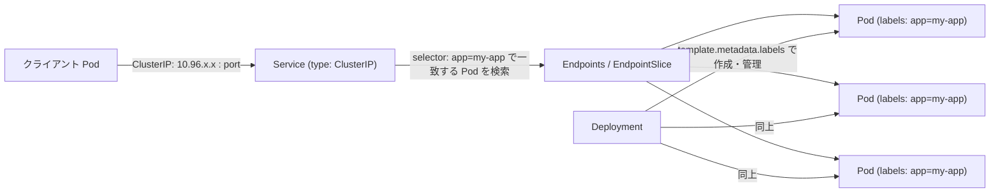

# ClusterIPを使ってサービスを他のサービスからアクセス可能にするためには、ClusterIP Serviceやdeploymentにどのような設定が必要ですか。それぞれの設定がどのような挙動をするのか含めて教えてください

## 概要

Kubernetes で Pod 群を「サービス」として他の Pod から利用可能にするには、`Service`(type: `ClusterIP`)と `Deployment` の 2 つのリソースを、ラベル(label)とセレクタ(selector)で結びつける形で設定します。`Deployment` が Pod を作成・管理し、`Service` はラベルセレクタに一致する Pod 群への「安定したアクセス窓口」を提供します。



## 何が嬉しいのか

- **Pod の IP は不安定**: Deployment 配下の Pod はスケールやローリングアップデート、再起動のたびに作り直され、その都度 IP アドレスが変わります。ClusterIP Service を使わないと、呼び出し側は常に最新の Pod IP 一覧を自前で追跡する必要があり現実的ではありません。
- **安定したアクセス先を提供**: Service は自身に割り当てられたクラスタ内部 IP(ClusterIP)と DNS 名を通じて、Pod の入れ替わりを意識せずにアクセスできる単一のエンドポイントを提供します。
- **ロードバランシング**: 複数の Pod にリクエストを自動的に分散します。呼び出し側でロードバランサを実装する必要がありません。
- **具体例**: フロントエンド Pod がバックエンド API を呼び出す際、`http://backend-service.my-namespace.svc.cluster.local` のような固定の DNS 名でアクセスすれば、バックエンドの Pod 数やスケジューリング結果が変わっても呼び出し側のコードやコンフィグを変更する必要がありません。

## 詳細

### 1. Deployment 側の設定

`Deployment` は Pod テンプレート(`spec.template`)に付与する `labels` が重要です。この `labels` が Service 側の `selector` と一致することで、Service はどの Pod をトラフィックの転送先とするかを判断します。また `containerPort` は、Service の `targetPort` と対応させるためのドキュメント的な役割(必須ではありませんが明示するのが推奨)を持ちます。

```yaml
apiVersion: apps/v1
kind: Deployment
metadata:
  name: my-app
spec:
  replicas: 3
  selector:
    matchLabels:
      app: my-app        # Deployment が「自分が管理する Pod」を識別するためのセレクタ
  template:
    metadata:
      labels:
        app: my-app       # ← この labels が Service の selector と一致する必要がある
    spec:
      containers:
        - name: my-app
          image: my-app:latest
          ports:
            - containerPort: 8080
          readinessProbe:    # readiness が failure だとこの Pod は Endpoints から除外される
            httpGet:
              path: /healthz
              port: 8080
            initialDelaySeconds: 5
            periodSeconds: 10
```

### 2. Service 側の設定

```yaml
apiVersion: v1
kind: Service
metadata:
  name: my-app-service
spec:
  type: ClusterIP        # 省略時のデフォルトもこの値
  selector:
    app: my-app           # Deployment の template labels と一致させる
  ports:
    - protocol: TCP
      port: 80             # Service 自身が公開するポート(クラスタ内の他 Pod からはこのポートにアクセス)
      targetPort: 8080     # 転送先の Pod 内コンテナが listen しているポート
```

### 3. それぞれの設定項目の挙動

- **`spec.selector`(Service)**: ここに指定したラベル(key-value)に一致する `labels` を持つ Pod だけが、Service のトラフィック転送先として `Endpoints`(または `EndpointSlice`)に登録されます。Pod が作成・削除されるたびに、Kubernetes のコントローラがこの一覧を自動更新します。
- **`spec.template.metadata.labels`(Deployment)**: Deployment が作成する Pod に付与されるラベルです。Service の `selector` はこのラベルを見て一致判定を行うため、両者のキー・値を揃える必要があります(なお、Deployment 自身が Pod を管理するために使う `spec.selector.matchLabels` も、この `template.metadata.labels` と一致している必要があります)。
- **`spec.ports[].port`**: Service が内部的に公開するポート番号です。クラスタ内の他の Pod は `<ClusterIP>:port` または `<Service名>:port` でアクセスします。
- **`spec.ports[].targetPort`**: 実際にトラフィックを転送する先の、Pod 内コンテナが listen しているポートです。数値だけでなくコンテナの `ports` で定義した名前を指定することも可能です。省略した場合は `port` と同じ値が使われます。
- **`type: ClusterIP`**: クラスタ内部からのみ到達可能な仮想 IP を割り当てるタイプです(デフォルトのタイプでもあります)。外部からの直接アクセスはできず、クラスタ内の Pod 間通信専用です。
- **DNS 名前解決**: クラスタに CoreDNS などの DNS が構成されている場合、Service には `<Service名>.<Namespace>.svc.cluster.local` という形式の DNS 名が自動的に割り当てられます。同一 Namespace 内であれば `<Service名>` だけでも解決可能です。
- **readinessProbe との関係**: Pod の `readinessProbe` が失敗している間、その Pod は Endpoints から一時的に除外され、Service 経由のトラフィックが転送されなくなります。これによりまだ準備ができていない Pod にリクエストが流れることを防げます。
- **転送の仕組み(概要)**: 各ノード上で動作する `kube-proxy` が Service の Endpoints 情報を監視し、iptables や IPVS などのルールを使って ClusterIP 宛のパケットを実際の Pod IP に転送します。具体的な転送モードやパケット処理の詳細はクラスタの構成(kube-proxy のモード設定など)に依存するため、確認が必要な場合はクラスタの設定を確認してください。

### 4. 注意点

- Service の `selector` と Deployment の Pod ラベルが一致していないと、Endpoints が空のままとなり、Service にアクセスしても応答が返りません(トラブルシューティング時は `kubectl get endpoints <service名>` で登録状況を確認するとよい)。
- `port` と `targetPort` を混同すると接続できなくなることがあるため、Pod 内で実際にコンテナが listen しているポートを `targetPort` に正しく指定する必要があります。

## 参考リンク

- [Service | Kubernetes](https://kubernetes.io/docs/concepts/services-networking/service/)
- [Deployments | Kubernetes](https://kubernetes.io/docs/concepts/workloads/controllers/deployment/)
- [DNS for Services and Pods | Kubernetes](https://kubernetes.io/docs/concepts/services-networking/dns-pod-service/)
